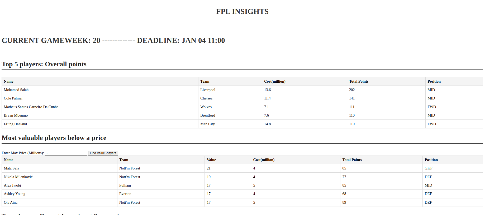
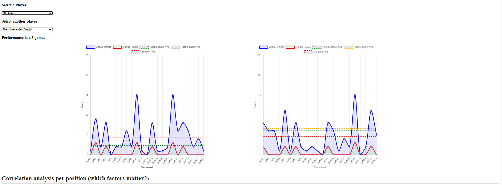

# Objectives
1. Visualise key information that is hard to do so in the FPL app
2. Predict points based on key factors: form, ICT values, opposition strength, etc
3. Find similar players based on key metrics, find value buys

## 1. Backend/ data engineering
* downloads season FPL data from the api
* downloads old season data from [github repo](https://github.com/vaastav/Fantasy-Premier-League)
* creates a simple database to store the data, and to query relevant data for the backend flask APIs
* also, a script that is meant to run weekly to get the updated gameweek data and update them into the db
* data cleaning and formatting

## 2. Frontend
* basic HTML and javascript for interactivity
* features: top players by score, top players by value, top players by recent performances, using plots of recent points to compare two players
* html and js interactivity: returns table/plot based on user inputs
  
#### Screenshots:

## 3. Data science
* ipynb exploratory analysis under the Data Science folder, e.g. visualising players via PCA and t-SNE, correlation statistics with total points, basic zero inflated poisson model to predict points, clustering players via kMeans
* exploring the predictors, finding correlations

